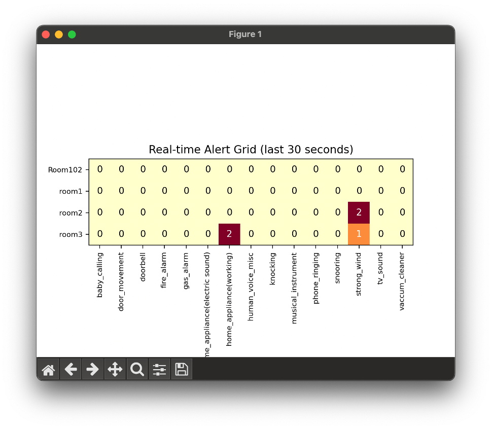
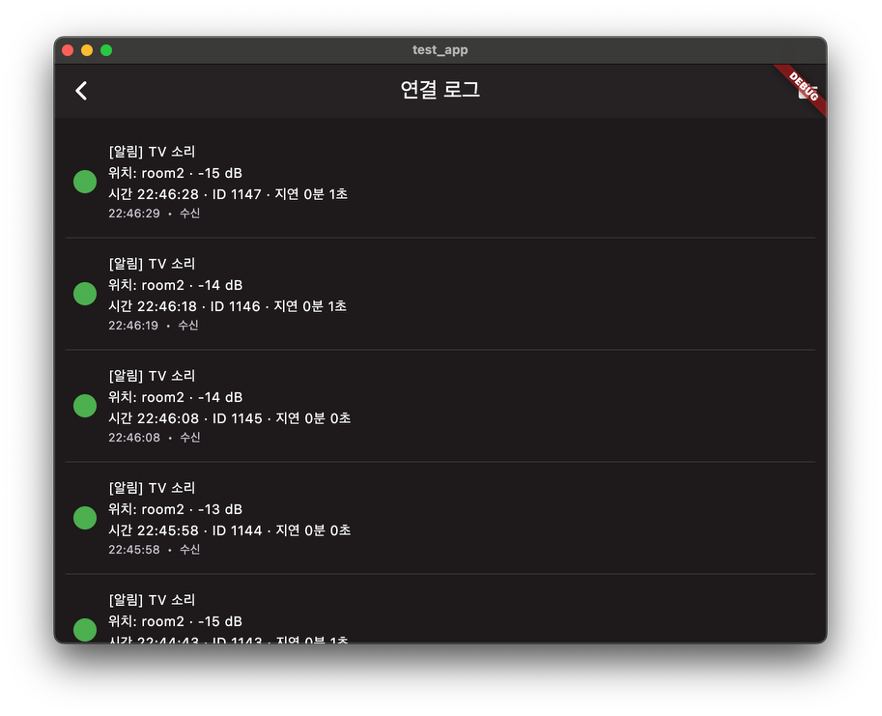

# How to Run & Setup Instructions

## Mac OS Users

If you are using macOS,

Before running the system, please follow these setup steps:

1. **Install Homebrew** (for macOS users):  
   Homebrew is required for installing dependencies such as git and tmux.
   ```bash
   /bin/bash -c "$(curl -fsSL https://raw.githubusercontent.com/Homebrew/install/HEAD/install.sh)"
   ```

2. **Install git and tmux** using Homebrew:
   ```bash
   brew install git tmux
   ```
   tmux is a terminal multiplexer that allows you to manage multiple terminal sessions from a single window. It is required for running the provided scripts and must be installed on macOS.

   **Basic tmux usage example:**
   ```bash
   tmux                # Start a new tmux session
   # ... run your commands ...
   Ctrl+b then d       # Detach from the tmux session (press Ctrl+b, then release and press d)
   ```

3. **Clone the repository and navigate to the project folder**:
   ```bash
   git clone <repository_url>
   cd capstone_EE
   ```

4. **Grant execute permission to the script**  
   Before running the script, make sure it is executable:
   ```bash
   chmod +x run_tmux.sh
   ```

## Windows Users

If you are using Windows, follow these additional steps before running the system:

1. **Install Windows Subsystem for Linux (WSL)**  
   Open PowerShell as Administrator and run:
   ```powershell
   wsl --install
   ```
   This will install WSL and prompt you to choose a Linux distribution (such as Ubuntu).

2. **Install git and tmux inside WSL**  
   After setting up Ubuntu (or your chosen distribution), open the WSL terminal and run:
   ```bash
   sudo apt update
   sudo apt install git tmux
   ```

3. **Clone the repository and navigate to the project folder**  
   As with macOS/Linux, run:
   ```bash
   git clone <repository_url>
   cd capstone_EE
   ```

4. **Grant execute permission to the script**  
   Before running the script, make sure it is executable:
   ```bash
   chmod +x run_tmux.sh
   ```


After completing the setup, run the following command to start the system:

```bash
./run_tmux.sh
```

When the command excutes successfully, you'll see the following output:

```bash
[OK] tmux 세션 2개 생성됨.
 - worker_socket 세션: tmux attach -t worker_socket
 - server 세션: tmux attach -t server
```
This confirms that two tmux sessions have been successfully created:

To close both sessions, run the following twice in your terminal 

```bash
tmux kill-session
tmux kill-session
```

# Project Directory Structure

```plaintext
capstone_EE/
├─ server.py                # HTTP 수신 서버, 업로드된 WAV 저장
├─ worker_socket.py         # 추론 및 알림 기능, 웹소켓 전송 기능
├─ web/
│  └─ websocket_server.py   # 실시간 알림 웹소켓 서버
├─ Model/                   # 사운드 분류 모델 및 추론 유틸
│  ├─ base_model_panns.py
│  ├─ inference_module.py
│  ├─ models.py
│  ├─ pytorch_utils.py
│  └─ training.py
├─ alert_system/
│  └─ notification.py       # 중복 알림 필터링 및 전송 로직
├─ node/                    # 센서 노드·장치 측 코드
│  ├─ wifi.ino
│  └─ node_wifi.py
├─ DB/                      # SQLite 연동 및 점검 스크립트
│  ├─ dataset_check.py
│  ├─ dataset_vis.py
│  ├─ insert.py
│  ├─ query.py
│  └─ sql_check.py
├─ data_visaualization/
│  └─ dbvisual_module.py    # DB 시각화 도구
└─run_tmux.sh              # 서버·워커를 tmux 세션으로 실행
```

# Seoultech EE 2025 Capstone Design (이민형, 김수왕, 김민지)  
### 이민형, 김수왕, 김민지  

## Project Description  

**Smart Home Assistance System for the Hearing Impaired**  

### 1. Introduction  

#### 1.1 Background and Motivation  

Hearing plays a crucial role in how people perceive and interact with their environment.  
Through sound, individuals can:  

- Determine the direction and distance of objects or events  
- Understand the structure of a space  
- Grasp the context of a situation  

However, individuals with hearing impairments face significant challenges in accessing this information. Without auditory input, it becomes difficult to:  

- Recognize spatial and situational cues  
- Stay aware of potential hazards  
- Respond effectively to surrounding events  

As a result, they may experience daily inconveniences and safety risks, which can limit thThe system consists of multiple sensor nodes installed in each room, which collect audio data in real-time. These sound recordings are transmitted to a central home server, where deep learning-based inference is performed to classify the events. 

After inference, a notification management algorithm filters out duplicate or unnecessary alerts. Finally, only meaningful notifications—containing event type and location—are delivered to the user 

#### 1.2 Project Objectives  

To develop an affordable home network-based system that collects sound data and analyzes it using deep learning, with the goal of providing hearing-impaired individuals with real-time information about the location and context of acoustic events in their living environment.  

#### 1.3 System Overview  

The system consists of multiple sensor nodes installed in each room, which collect audio data in real-time. These sound recordings are transmitted to a central home server, where deep learning-based inference is performed to classify the events. 

After inference, a notification management algorithm filters out duplicate or unnecessary alerts. Finally, only meaningful notifications—containing event type and location—are delivered to the user through the designated interface. These auditory cues help people detect unseen dangers or recognize when someone is calling them.  

## 2. Related Work  

1. Existing Sound Recognition Systems  
2. Accessibility Technologies in Smart Homes  
3. Comparison with Similar Research  

# Project Timeline

## 1. System Design  

1. Hardware Architecture  
2. Hardware Configuration  
3. Central Hub and Server Design  
4. Communication Protocols  

## 2. Sound Classification  

1. Dataset Collection and Preprocessing  
2. PANNs Model and Transfer Learning  
3. Class Definitions and Label Mapping  
4. Embedding Extraction and Classifier Design  

## 3. Alert Management System  

1. Mapping Sound Classes to Alert Priorities  
2. Personalized Notifications (Vibration, Visuals, Logging)  

## 4. Implementation  

1. Data Flow and System Workflow   
2. Integration of ESP32 and Server  
3. Implementation Images and Descriptions  

  
최신 인퍼런스 결과가 SQLite DB에 반영된 상태를 시각화한 화면입니다.  

## 5. Android App

1. Architecture & Networking  
    - Receives server events via HTTP/WebSocket and keeps worker alerts synchronized (Completed)  
2. Backend Integration Layer  
    - Implements retry strategy (Completed)  


3. Local DB & Storage  
    - Stores alert logs with Room DB and manages sync queue using WorkManager (Completed)  

  
실시간 업로드가 접속 로그에 기록되는 모습을 확인할 수 있습니다.  

4. Frontend UI/UX  
    - Delivers accessibility-first screens, event timeline, and per-room filters/visualizations (Completed)  
5. Push & Haptics  
    - Supports priority-based notification channels, vibration patterns, and user preferences (Completed)  
6. Testing & Release Prep  
    - Running UI tests, rolling out to internal track, refining QA checklist (In progress)  

## 6. Evaluation  

1. Classification Accuracy and Model Performance  
    - 모의 테스트 진행 완료, 정확도 98%  
2. Real-World Testing Results  
    - 테스트 진행 중
3. User Feedback (Optional)  
    - 피드백 진행 중

# Conclusion  

1. Summary and Achievements  
2. Limitations and Challenges  
3. Future Work and Improvements  
