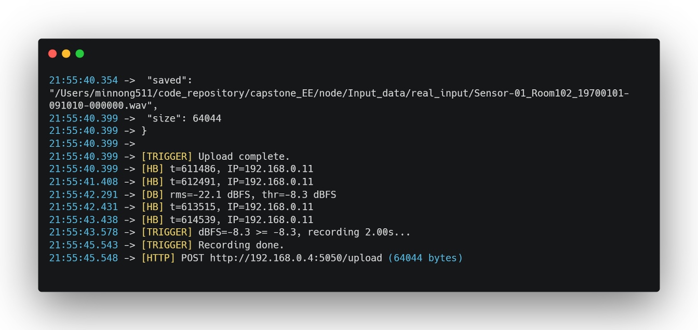
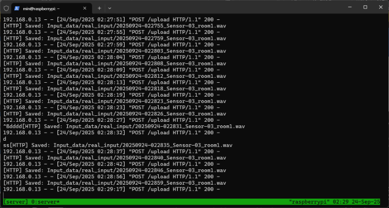
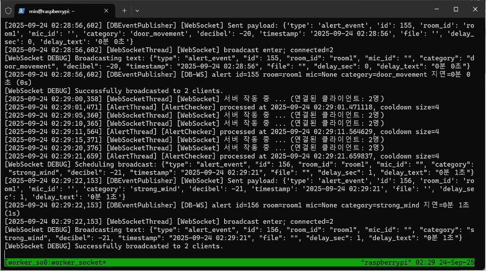
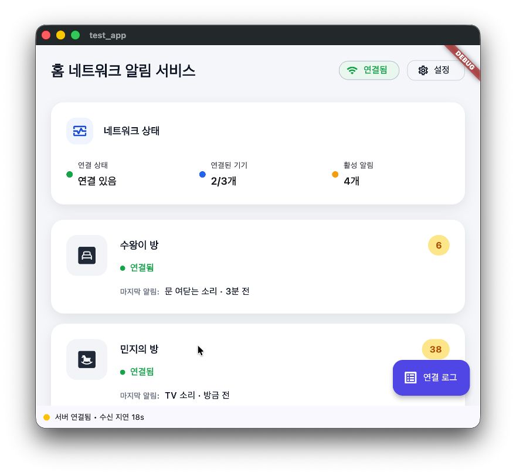
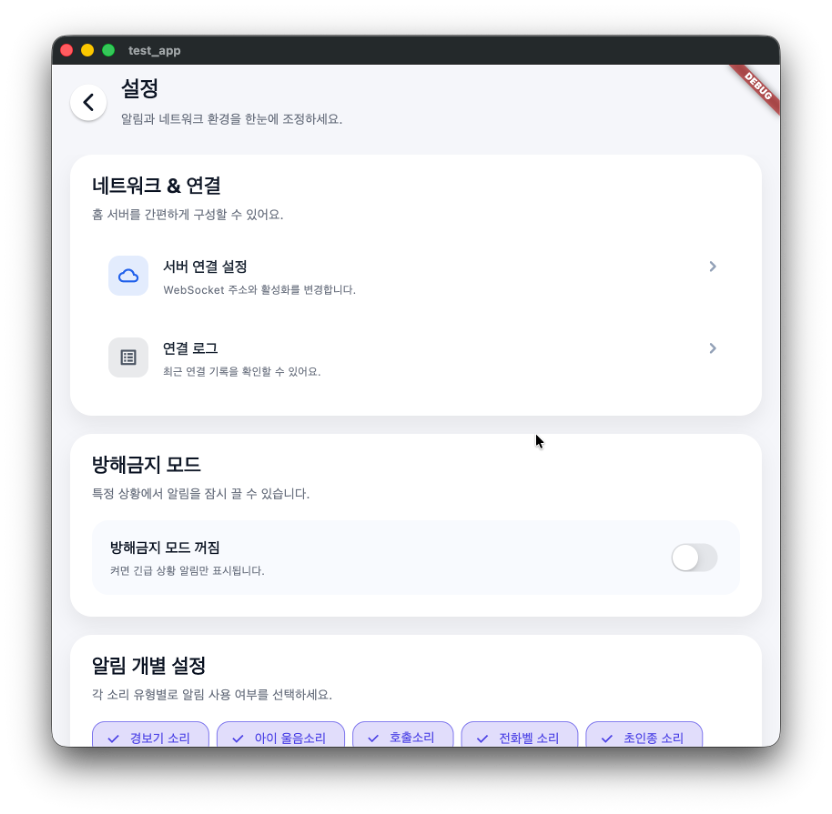
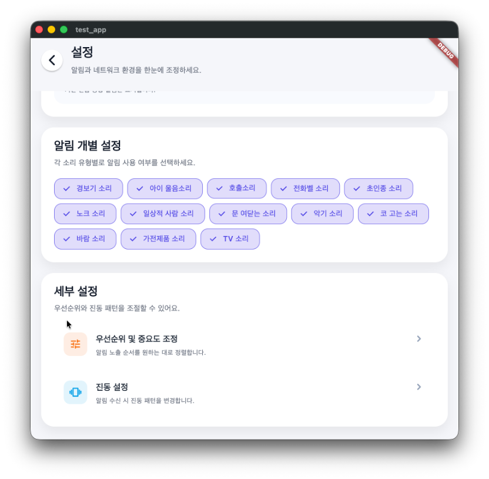
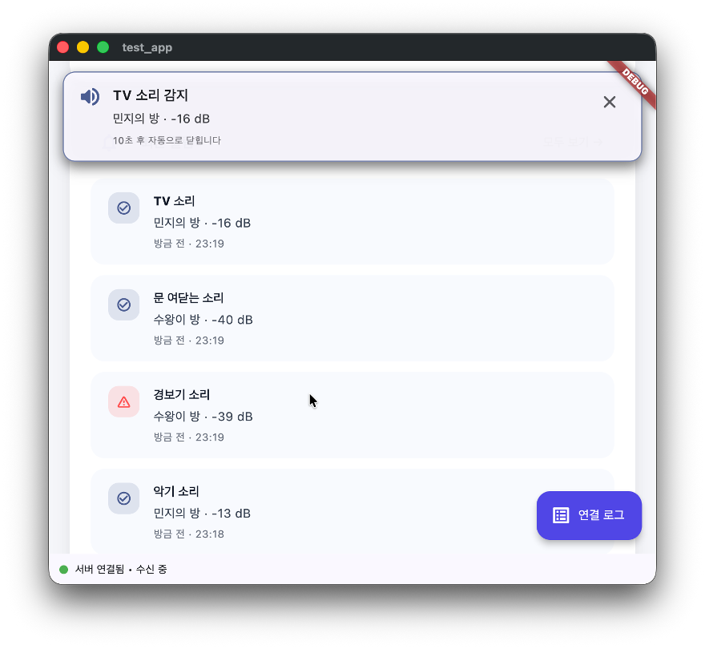

# Smart Home Assistance System for the Hearing Impaired

### **서울과학기술대학교 전기정보공학과 2025년 캡스톤디자인 프로젝트**

### **Seoultech Electrical Engineering Capstone Design**


# Quick Start

### macOS
1. **Install Homebrew** (필요 패키지 설치용)
   ```bash
   /bin/bash -c "$(curl -fsSL https://raw.githubusercontent.com/Homebrew/install/HEAD/install.sh)"
   ```
2. **Install git, tmux**
   ```bash
   brew install git tmux
   ```
3. **Clone the repository**
   ```bash
   git clone <repository_url>
   cd capstone_EE
   chmod +x run_tmux.sh
   ```

### Windows (WSL)
1. **Enable WSL**
   ```powershell
   wsl --install
   ```
2. **Install git, tmux inside WSL**
   ```bash
   sudo apt update
   sudo apt install git tmux
   ```
3. **Clone and prepare the project**
   ```bash
   git clone <repository_url>
   cd capstone_EE
   chmod +x run_tmux.sh
   ```

### Python Environment
```bash
conda create -n capstone python=3.11
conda activate capstone
pip install -r requirements.txt
```
`requirements.txt`에 필요한 라이브러리가 정리되어 있습니다. 

### Run the System
```bash
./run_tmux.sh
```
성공 시 다음과 같은 메시지가 출력됩니다. 
```text
[OK] tmux 세션 2개 생성됨.
 - worker_socket 세션: tmux attach -t worker_socket
 - server 세션: tmux attach -t server
```
필요 시 `tmux attach -t <세션명>`으로 각각의 세션을 확인하고, 

종료는 `tmux kill-session`을 사용합니다.

개별 실행이 필요하면 다음 명령을 사용하세요.
```bash
python server.py
python worker.py
```


# Project Structure

```plaintext
capstone_EE/
├─ server.py                # HTTP 수신 서버, 업로드된 WAV 저장
├─ worker.py                # 사운드 추론 및 알림 필터링
├─ worker_socket.py         # 웹소켓 전송 기능
├─ web/
│  └─ websocket_server.py   # 실시간 알림 웹소켓 서버
├─ Model/
│  ├─ base_model_panns.py   # 백본 네트워크 
│  ├─ inference_module.py   # 데이터 추론용 모듈 
│  ├─ models.py             # 사운드 이벤트 분류기 정의
│  ├─ pytorch_utils.py      # PyTorch 함수 모음
│  └─ training.py           # 모델 학습/파인튜닝 파이프라인
├─ alert_system/
│  └─ notification.py       # 중복 알림 필터링 및 전송 로직
├─ node/
│  ├─ node_wifi.py          # Flask 업로드 서버 및 CLI 유틸리티
│  └─ wifi.ino              # ESP32 펌웨어
├─ DB/
│  ├─ inference_results.db  # 추론 결과 저장용 SQLite DB
│  ├─ dataset_check.py      
│  ├─ dataset_vis.py        # 데이터셋 시각화 유틸리티
│  ├─ insert.py             # DB 더미 데이터 삽입 도구
│  ├─ query.py              # DB 조회 헬퍼 함수
│  └─ sql_check.py          # SQL 실행/검증 스크립트
├─ Input_data/
│  ├─ real_input/           # 실시간 업로드 저장 경로
│  └─ simulator_input/      # 시뮬레이터용 테스트 파일
├─ data_visaualization/
│  └─ dbvisual_module.py    # DB 기반 시각화 스크립트
└─ run_tmux.sh              # 서버 실행 스크립트
```


# System Overview

1. 센서 노드는 각 방에 설치됩니다. 설치된 **센서의 마이크**들이 실시간으로 소리를 수집합니다. 

   >다만 모든 소리가 녹음되는 것은 아니며, 
   사생활보호를 위해 임계치를 초과한 소리만이 녹음됩니다.

2. 임계치의 경우 개별 방마다 다를 수 있기 때문에, 개별 방에 맞게 임계치를 설정합니다. 따라서 임계치를 설정하기 위해서 기준치를 먼저 측정합니다,
   > 기준치의 경우에 방 안의 평균 소음을 5초 측정하여 평가합니다. 
   이후 측정된 기준치를 바탕으로 offset 기준치를 더해서 임계치를 설정합니다.

3. 임계치를 초과한 소리가 감지되면 2초간 녹음 후, 파일을 서버로 전송합니다. 파일을 수신받은 서버는 딥러닝 모델(PANNs 백본 기반)로 소리를 분류합니다.

4. 이후 알림 관리 알고리즘이 중복 및 불필요한 알림을 제거하고, 
사용자에게 이벤트 유형과 위치를 저장합니다. 모바일 앱은 DB(`DB/inference_results.db`)에 저장되어 있는 알림 추론결과를 수신받습니다.

5. 수신 받은 결과를 안드로이드 앱이 처리하여 최종적으로 사용자에게 알림을 출력합니다. 

# Workflow

## 1. 센서 노드가 주변 소음을 기록하고 임계치 기반으로 이벤트를 추출

## Sound Trigger Math (RMS & dBFS)

### Block size
샘플레이트 $f_s$, 블록 길이 $T_{\text{hop}}$일 때 한 블록의 샘플 수:

$$
M=\left\lfloor f_s \cdot T_{\text{hop}} \right\rfloor
$$

예: $f_s=16000\,\text{Hz},\ T_{\text{hop}}=0.032\,\text{s} \Rightarrow M\approx512$

---

### 1) 블록 RMS
블록 샘플 $x[0],\dots,x[M-1]$ (16-bit 정수, $|x[n]|\le 32768$)에 대해

$$
\mathrm{RMS}=\sqrt{\frac{1}{M}\sum_{n=0}^{M-1}x[n]^2}
$$

### 2) dBFS 변환
Full Scale $=32768$일 때 블록의 dBFS:

$$
d_i=20\log_{10}\!\left(\frac{\mathrm{RMS}}{32768+\varepsilon}\right)
$$
> $\varepsilon$는 $\log(0)$ 방지용의 아주 작은 값.

---

### 3) 주변 소음(캘리브레이션) 평균
캘리브레이션 구간 길이 $T_{\text{cal}}$ 동안 $N$개 블록 수집:

$$
N=\left\lfloor \frac{T_{\text{cal}}}{T_{\text{hop}}}\right\rfloor,\qquad
\mathrm{Ambient}_{\mathrm{dBFS}}=\frac{1}{N}\sum_{i=1}^{N}d_i
$$

---

### 4) 임계치(Threshold)
민감도 여유 $\Delta_{dB}$ (예: `THRESH_DB_ABOVE = 8`)를 더해 최종 임계치:

$$
T_{\mathrm{dBFS}}=\mathrm{Ambient}_{\mathrm{dBFS}}+\Delta_{dB}
$$

---

### 5) 트리거 판정
실시간 블록 $k$의 dBFS를 $d^{(k)}$라 할 때,

$$
d^{(k)}\ge T_{\mathrm{dBFS}}
$$

가 **연속** $L$블록(예: `MIN_BLOCKS_OVER = L = 1`) 이상이면 트리거.


_ESP32에서 이벤트가 감지된 직후 업로드 흐름_

## 2. 녹음된 WAV 파일을 서버로 업로드 (`server.py` → `Input_data/real_input/`)


_HTTP 서버가 수신한 WAV 파일 저장 화면_

## 3. `worker.py`가 새 파일을 감지하여 추론 수행 및 결과를 DB에 저장


_워커가 파일을 처리하고 결과를 기록하는 로그_

## 4. `alert_system/notification.py`가 우선순위와 중복 여부를 판별

## 5. 웹소켓 서버(`web/websocket_server.py`)와 모바일 앱이 알림을 수신


_웹소켓을 통해 알림을 전달하는 서버 로그_

## 6. 앱이 알림을 출력 


_메인 페이지_


_설정창 1_


_설정창 2_



_최종적으로 알림을 출력하는 모습_


# Project Milestones

### 2025.03.01 ~ 2025.11.27

### 1. System Design
- Hardware Architecture 및 Configuration 설정 (완료)
    - ESP32 
    - INMP441 MEMS MIC
- 중앙 서버 구성, 통신 프로토콜 정의 (완료)
    - Main server : Raspberry Pi5 8GB 
    - ESP32 - Server
        - Python Flask 
    - Server - APP
        - WebSocket


### 2. Sound Classification
- 데이터셋 구축 및 전처리 (완료)
- PANNs 기반 전이학습과 분류기 설계 (완료)
- 클래스 정의 및 라벨 매핑, 임베딩 추출 파이프라인 구축 (완료)
- 분류기 학습 및 추론 테스트 (완료)

### 3. Alert Management
- 소리 클래스별 알림 우선순위 설정 (완료)
- 알림 처리 분류 알고리즘 작성 (완료)
- 알고리즘 코드 구현 (완료)

### 4. Implementation
- ESP32 ↔ 서버 통신 통합 (완료)
- 데이터 송수신 및 시스템 작동 검증 (완료)

### 5. Android App
- 서버 이벤트를 HTTP/WebSocket으로 수신하여 워커 알림과 동기화 (완료)
- 재전송 전략 및 백엔드 연계 계층 구현 (완료)
- Room DB 및 WorkManager 기반 로컬 로그 관리 (완료)
- 접근성 중심 UI, 이벤트 타임라인, 방별 필터 제공 (완료)
- 우선순위별 푸시/진동 채널 지원, 사용자 선호도 설정 (완료)
- UI 테스트 및 QA (완료)

### 6. Evaluation
- 모의 테스트 정확도 98% 달성 (완료)
- 실환경 테스트 진행 중, 사용자 피드백 수집 중 (완료)
